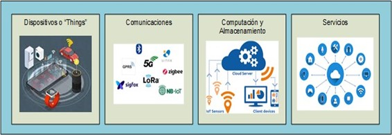

<h1><p align="center">Lunaris</p></h1>

<p align="center">
  
</p>

<p align="center">
  Sistema IoT de control de constantes principales para cohetería
</p>

---

Proyecto con fines teóricos en el que se implementa la cadena completa del ciclo de datos en un sistema IoT simulando una misión de cohetería. Lunaris es el nombre que recibe un cohete amateur cuya misión es alcanzar los 1.000 metros de altura y descender con éxito para su reutilización en posteriores misiones, la finalidad de la expedición es la obtención de datos que los sensores abajo detallados recogerán y serán de utilidad para simulaciones, ajustes y mejoras en futuros proyectos de la compañía. 

## Sobre nuestra propuesta

### Qué se incluye en él?

Tratamos de implementar una aproximación de lo que sería cada una de las fases del procesado de datos en tiempo real.

<p align="center">
  
</p>


<p align="center">
  <em>Ciclo de datos IoT: sensores → protocolos → ingesta/almacenamiento → API/dashboards</em>
</p>

1. **Sensores y "things"**: en la primera fase, los sensores capturan datos de la realidad. Una cosa es cualquier elemento del mundo real que emita datos que podamos capturar, en nuestro caso, trabajaremos con el cohete y los datos que genera al llevar a cabo la misión.

2. **Comunicaciones**:
3. **Ingesta y almacenamiento**:
4. **Visualización y servicios**: 


### Como se estructura el proyecto?

```
lunaris/
├── docs/
│── sensors/               # Simuladores de datos
│     ├── barometer.py
│     ├── README.md
│     ├── sensor2.py
│     └── sensor3.py
│── utils/
│     ├── noise.py
│     └── README.md
├── .env
├── docker-compose.yml
├── Dockerfile
├── main.py
├── README.md
└── requirements.txt
```